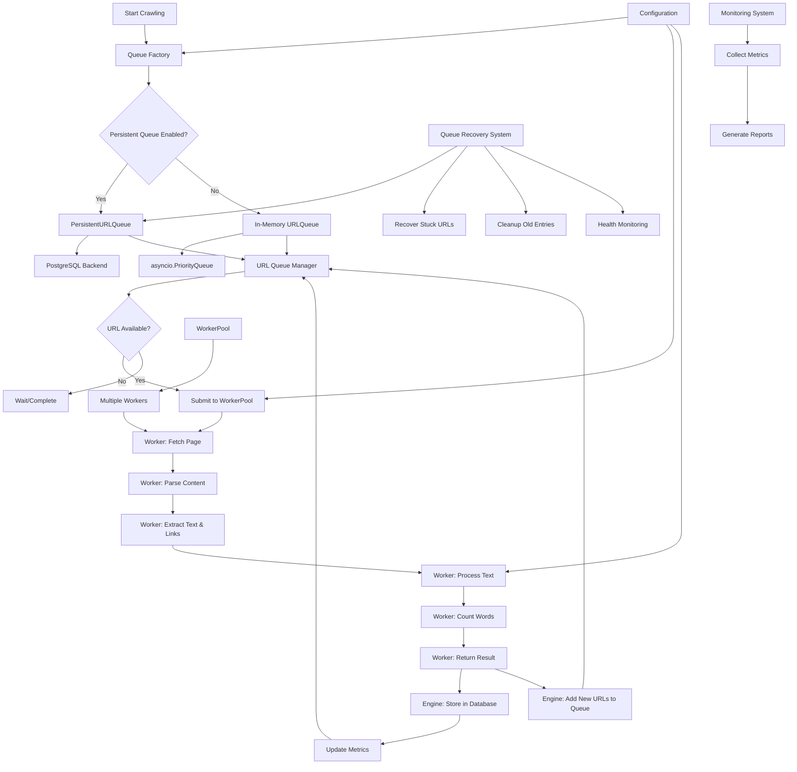
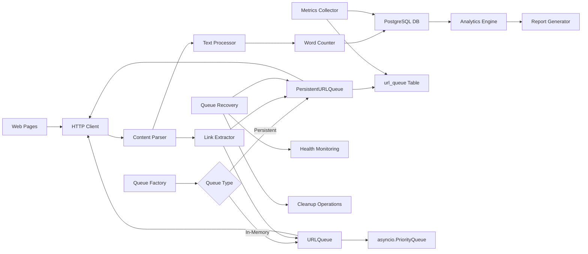

# Web Crawler System Architecture

## System Overview

This document outlines the architecture for a large-scale web crawler system designed to retrieve, analyze, and store web content with advanced analytics capabilities.

## Architecture Components

### 1. Core Crawler Engine
- **Technology**: Python with asyncio for concurrent processing
- **Purpose**: Main crawling logic with WorkerPool-based architecture
- **Key Features**:
  - WorkerPool-based concurrent processing with individual worker instances
  - Robust error handling and retry mechanisms
  - Rate limiting and politeness policies
  - Session management with connection pooling
  - Sitemap discovery and robots.txt compliance
  - Comprehensive performance profiling integration

### 2. URL Management System
- **Components**:
  - **Queue Factory**: Configurable queue implementation selection
  - **In-Memory Queue**: Priority-based with depth tracking using `QueuedURL` dataclass
  - **Persistent Queue**: PostgreSQL-backed queue with crash recovery
  - Visited URL Set (bloom filter for probabilistic deduplication)
  - URL Validator and Normalizer
  - Robots.txt Compliance Checker
- **Features**:
  - **Configurable Queue Backend**: Switch between in-memory and persistent queues
  - **PostgreSQL Persistence**: Full ACID compliance with crash recovery
  - **Session Isolation**: Each crawl session maintains its own queue namespace
  - **Priority Processing**: URLs processed by priority and depth
  - **Automatic Recovery**: Stuck processing URLs automatically reset to pending
  - **Health Monitoring**: Real-time metrics and bottleneck analysis
  - **Cleanup Automation**: Automatic removal of old completed/failed entries
  - Duplicate URL detection using bloom filters
  - Domain-based rate limiting with `get_with_rate_limit()`
  - Configurable depth limits

### 3. Content Processing Pipeline
- **Text Extraction**: BeautifulSoup for HTML parsing with ContentExtractor
- **Content Cleaning**: Remove scripts, styles, and non-text elements via ContentProcessor
- **Text Preprocessing**: Tokenization, normalization, stop word removal
- **Word Frequency Analysis**: WordFrequencyAnalyzer with efficient counting algorithms
- **Performance Profiling**: Each stage is profiled with detailed timing metrics

### 4. Data Storage Layer
- **Primary Database**: PostgreSQL
- **Schema Design**:
  - `crawl_sessions` - Track crawling sessions and metadata
  - `pages` - Store page content and metadata
  - `word_frequencies` - Store word counts per page
  - `links` - Store discovered links and relationships
  - `crawl_metrics` - Performance and monitoring data
  - **`url_queue`** - Persistent URL queue with status tracking and priority ordering

### 5. Monitoring and Analytics
- **Real-time Metrics**: Pages crawled, errors, performance stats
- **Performance Monitoring**: Response times, memory usage, CPU utilization
- **Analytics Engine**: Word frequency analysis
- **Reporting**: Automated report generation

### 6. Configuration Management
- **Configurable Parameters**:
  - Crawling depth limits
  - Concurrent worker count
  - Rate limiting settings
  - Database connection parameters
  - Content filtering rules
  - **Persistent Queue Settings**: Enable/disable persistent queues

## System Flow Diagram

## Data Flow Architecture

## Performance Considerations

### Scalability Features
1. **Asynchronous Processing**: Handle thousands of concurrent requests
2. **Database Optimization**: Proper indexing and query optimization
3. **Connection Pooling**: Reuse HTTP and database connections
4. **Persistent Queue Optimization**: Background sync workers and optimized database operations

### Resource Management
1. **Rate Limiting**: Respect server resources and avoid being blocked
2. **Depth Control**: Prevent infinite crawling loops
3. **Content Size Limits**: Avoid processing extremely large pages
4. **Timeout Management**: Handle slow or unresponsive servers
5. **Queue Management**:
   - Automatic cleanup of old completed/failed entries
   - Recovery timeout for stuck processing URLs
   - Configurable retry attempts with exponential backoff
   - Health monitoring and bottleneck detection

### Persistent Queue Performance
1. **Database Indexing Strategy**:
   - Primary UUID index for fast lookups
   - Session-based composite indexes
   - Status and priority indexes for efficient filtering
   - Discovery time indexes for chronological ordering
2. **Batch Operations**:
   - Bulk URL insertion and updates
   - Batch cleanup operations
   - Efficient recovery queries
3. **Memory Optimization**:
   - In-memory caching for frequently accessed URLs
   - Bloom filter integration for duplicate detection
   - Efficient data structure usage

## Security and Compliance
1. **Robots.txt Compliance**: Respect website crawling policies
2. **User-Agent Identification**: Proper crawler identification
3. **SSL/TLS Support**: Secure HTTPS connections
4. **Error Handling**: Graceful handling of various HTTP errors

## Technology Stack Summary
- **Language**: Python 3.9+
- **Async Framework**: asyncio
- **HTTP Client**: aiohttp
- **HTML Parsing**: BeautifulSoup4
- **Database**: PostgreSQL with asyncpg
- **Queue Systems**:
  - **In-Memory**: asyncio.PriorityQueue with bloom filters
  - **Persistent**: PostgreSQL-backed with ACID compliance
  - **Factory Pattern**: Configurable queue implementation selection
- **Monitoring**: Custom metrics with optional Prometheus integration
- **Configuration**: YAML/JSON configuration files with environment variable support
- **CLI Tools**: Queue recovery and management utilities
